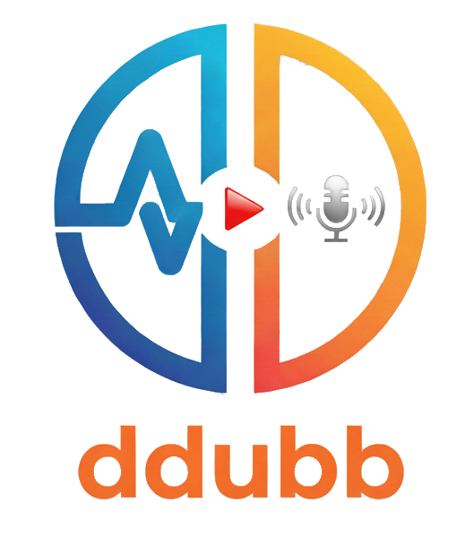

# AI Dubbing

<p align="center">
  <a href="https://youtu.be/r5vSj6TRk8Y" target="_blank" rel="noopener noreferrer">
    
  </a>
</p>

## Áttekintés (HU)
Az AI Dubbing egy eszközkészlet videók és hanganyagok többnyelvű szinkronizálásához. A folyamat WhisperX-alapú átiratozást, opcionális beszélőszétválasztást és többféle TTS modellt kombinál a végső kimenet előállításához.
Az `main_app.py` Flask-alapú vezérlőfelület, amely a `scripts/scripts.json` konfigurációja alapján kínálja fel a `scripts/` alatti modulokat, így a teljes workflow egy helyről indítható.

## Telepítési és környezeti útmutató (HU)
1. Telepítsd az alap `sync` conda környezetet a [sync-linux telepítési útmutató](ENVIROMENTS/sync-linux.md) alapján; ez az elsődleges workflow környezet.
2. A pipeline specializált komponenseihez hozz létre külön környezeteket (mindegyik Ubuntu 24.04-re készült leírás):
   - [whisperx-linux telepítési útmutató](ENVIROMENTS/whisperx-linux.md) – több-GPU WhisperX ASR és aligner futtatásához.
   - [nemo-linux telepítési útmutató](ENVIROMENTS/nemo-linux.md) – NVIDIA NeMo-alapú Canary/Parakeet ASR-ekhez és diarizációhoz.
   - [f5-tts-linux telepítési útmutató](ENVIROMENTS/f5-tts-linux.md) – F5-TTS modellekhez és a kapcsolódó normalizáló segédszkriptekhez.
   - [vibevoice-linux telepítési útmutató](ENVIROMENTS/vibevoice-linux.md) – VibeVoice TTS pipeline futtatásához.
   - [demucs-linux telepítési útmutató](ENVIROMENTS/demucs-linux.md) – Demucs/MDX-alapú beszéd–háttér szétválasztáshoz.
3. A `main_app.py` indítását mindig a `sync` környezetből végezd; a többi specializált környezetet a rendszer futás közben automatikusan kezeli.

## Modell- és API-előkészítés (HU)
- Frissítsd a `/anaconda3/envs/whisperx/lib/python3.10/site-packages/whisperx/alignment.py` fájlt, és állíts be pontosabb alapértelmezett igazítási modelleket, hogy javuljon az időzítés pontossága.
- F5-TTS használatához másold a saját `model.pt`, `vocab.txt` és `model_conf.json` fájljaidat a megfelelő `TTS/XXX` alkönyvtárba; sablonfájlokat a `TTS` mappában találsz.
- VibeVoice esetén lépj a `TTS` mappába, és klónozd a szükséges Hugging Face repót (például: `git clone https://huggingface.co/sarpba/VibeVoice-large-HUN`).
- (Opcionális) Hozz létre Hugging Face fiókot, fogadd el a Pyannote Speaker Diarization 3.1 licencét, majd generálj és tárolj biztonságosan egy olvasási API-kulcsot: https://huggingface.co/pyannote/speaker-diarization-3.1
- Regisztrálj DeepL fiókot, aktiváld az ingyenes API-előfizetést, és készíts API-kulcsot (kb. 500 000 karakter/hó, ~10–20 óra videó).
- Regisztrálj ElevenLabs fiókot az ASR modul használatához; havi kb. 2–3 óra ingyenes kredit áll rendelkezésre.

## Pipeline modulok és szkript katalógus

Az alábbi összefoglaló a `scripts/` könyvtár `*_help.md` fájljaira támaszkodva sorolja fel a fő modulokat. Minden pont feltünteti a javasolt conda környezetet; a részletes CLI opciókat a kapcsolódó help állományban találod.

### Bemeneti előkészítés és fájlkezelés
- `scripts/AUDIO-VIDEO/audio_copy_helper/audio-copy-helper.py` (`sync`) – Feltöltött audiókat 44,1 kHz-es WAV-ra konvertál, majd a megadott projekt almappákba (`--extracted_audio`, `--separated_audio_*`) másolja a kötelező `-p/--project-name` paraméterrel.
- `scripts/AUDIO-VIDEO/extract_audio_from_video/extract_audio_easy_channels.py` (`sync`) – Az `upload` könyvtár első videójából kinyeri az audiosávot, igény szerint csatornánként külön fájlokat készít (`--keep_channels`), és az `extracted_audio` mappába menti.
- `scripts/AUDIO-VIDEO/separate_speak_and_background_audio/separate_audio_easy.py` (`demucs`) – Demucs/MDX modellekkel választja szét a beszédet és a háttérsávot; `--models`, `--chunk_size`, `--background_blend` opciókkal finomhangolható.
- `scripts/AUDIO-VIDEO/unpack_srt_from_mkv/unpack_srt_from_mkv_easy.py` (`sync`) – Az MKV-ba ágyazott `.srt` feliratot a projekt `subtitles` mappájába exportálja.

### ASR és újraszegmentálás
- `scripts/ASR/canary-non_working_beta/canary-easy.py` (`nemo`) – NVIDIA Canary ASR-t futtat a `separated_audio_speech` hangokon automatikus vagy fix chunkokkal, opcionális fordítással (`--source-lang`, `--target-lang`, `--keep_alternatives`).
- `scripts/ASR/elevenlabs/elevenlabs.py` (`sync`) – ElevenLabs STT API-t hív, normalizált `word_segments` JSON-t ír minden fájl mellé, és az API-kulcsot a `keyholder.json` kezeli (`--api-key`, `--diarize`).
- `scripts/ASR/paraket-eng/parakeet-tdt-0.6b-v2.py` (`nemo`) – Parakeet TDT 0.6B v2 modellt futtat automatikus chunk kalibrációval; a szegmenshatárok `--max-pause`, `--timestamp-padding`, `--max-segment-duration` paraméterekkel szabhatók testre.
- `scripts/ASR/paraket-multilang/parakeet-tdt-0.6b-v3.py` (`nemo`) – Többnyelvű Parakeet TDT v3 pipeline, amely ugyanazon CLI-t kínálja kibővített nyelvi lefedettséggel.
- `scripts/ASR/whisperx/whisx_v1.1.py` (`whisperx`) – WhisperX `large-v3` modellt futtat több GPU-n, opcionális pyannote diarizációval (`--hf_token`, `--gpus`, `--timestamp-padding`), és a kimenetet a `separated_audio_speech` mellé menti.
- `scripts/ASR/resegment/resegment.py` (`sync`) – Az ASR által írt JSON-t újraszegmentálja energia-alapú korrekcióval és biztonsági mentéssel (`--max-pause`, `--timestamp-padding`, `--enforce-single-speaker`).
- `scripts/ASR/resegment-mfa/resegment-mfa.py` (`sync`) – Montreal Forced Alignerrel pontosítja a szó időbélyegeket (`--use-mfa-refine`), miközben a resegment szokásos paramétereit kínálja.

### Diarizáció
- `scripts/DIARIZE/speaker_diarize_e2e_non_working_beta/e2e_diarize_speech.py` (`nemo`) – Sortformer-alapú end-to-end diarizáció Hydra konfigurációval és opcionális Optuna utófeldolgozási kereséssel.
- `scripts/DIARIZE/speaker_diarize_pyannote/split_segments_by_speaker.py` (`sync`) – Pyannote diarizációval rendezi a meglévő szegmenseket beszélő szerint (`--hf-token`, `--min-chunk`, `--no-backup`, `--dry-run`).

### Fordítás
- `scripts/TRANSLATE/chatgpt_with_srt/translate_chatgpt_srt_easy.py` (`sync`) – ChatGPT API-val fordít, igény szerint SRT kontextust fűz a promptba, a kulcsot a `keyholder.json` tárolja (`-input_language`, `-output_language`, `-model`, `-auth_key`).
- `scripts/TRANSLATE/deepl/deepl_translate.py` (`sync`) – DeepL REST API-t hív és a `translated` könyvtárba ír, az `--auth-key` base64 formában kerül a `keyholder.json`-ba, a hiányzó nyelvi kódokat a `config.json` tölti fel.

### TTS
- `scripts/TTS/f5-tts/f5_tts_easy_EQ.py` (`f5-tts`) – F5-TTS alap pipeline EQ és Whisper verifikáció opciókkal (`--norm`, `--eq-config`, `--max-retries`, `--whisper-model`).
- `scripts/TTS/f5-tts-narrator/f5_tts_narrator.py` (`f5-tts`) – Narrátor könyvtárból (`--narrator`) dolgozik, miközben megtartja az F5-TTS többlépcsős ellenőrzését.
- `scripts/TTS/vibevoice_old/vibevoice-tts.py` (`vibevoice`) – Alap VibeVoice TTS LoRA támogatással, `--norm`, `--cfg_scale`, `--checkpoint_path`, `--seed`, `--max_retries` opciókkal és Whisper utóellenőrzéssel.
- `scripts/TTS/vibevoice_1.1/vibevoice-tts_v1.1.py` (`vibevoice`) – Dedikált GPU-worker kiosztással és sikertelen generálásokhoz mentett referencia mintával biztosít stabilabb futást.
- `scripts/TTS/vibevoice_1.2/vibevoice-tts_v1.2.py` (`vibevoice`) – Pitch alapú ellenőrzést és újrapróbálkozást (`--enable_pitch_check`, `--pitch_tolerance`, `--pitch_retry`) épít a VibeVoice folyamathoz.
- `scripts/TTS/vibevoice-narrator/vibevoice-tts_narrator.py` (`vibevoice`) – Egyetlen narrátor WAV mintából dolgozik (`--narrator`), miközben megőrzi a VibeVoice EQ/normalizálási beállításait.

### Audio mastering és kiszolgálás
- `scripts/AUDIO-VIDEO/normalize_and_cut_tts_files_old_version/normalise_and_cut_json_easy.py` (`sync`) – Az elkészült szegmenseket RMS szerint a referenciához igazítja, VAD alapján levágja a csendes részeket, és opcionálisan törli az üres fájlokat (`--delete_empty`, `--no-sync-loudness`).
- `scripts/AUDIO-VIDEO/normalize_and_cut_tts_files/normalise_and_cut_json_easy_v1.1.py` (`sync`) – A v1.1 FFmpeg `silenceremove`-val vágja le a végi csendet, peak limitet alkalmaz, és ugyanazokat a normalizáló opciókat kínálja.
- `scripts/AUDIO-VIDEO/merge_chunks_with_background/merge_chunks_with_background_easy.py` (`sync`) – Időbélyeg alapján fűzi össze a `translated_splits` kimenetet, narrátor módban `--background-volume` flaggel kever háttérsávot, és a `film_dubbing` mappába menti.
- `scripts/AUDIO-VIDEO/merge_chunks_with_bacground_v1.1/merge_chunks_with_background_easy.py` (`sync`) – A fenti funkciókat kiegészíti a `--time-stretching` kapcsolóval, amely hangmagasságot nem változtató gyorsítást alkalmaz az átfedések elkerülésére.
- `scripts/AUDIO-VIDEO/merge_chunks_with_background_narrator_version/merge_chunks_with_background_beta.py` (`sync`) – Narrátor fókuszú beta verzió, amely `--max-speedup` paraméterrel szabályozza az átfedő szegmensek összehúzását a háttérkeverés mellett.
- `scripts/AUDIO-VIDEO/merge_dub_to_video/merge_to_video_easy.py` (`sync`) – A végső audiót és (ha van) a feliratot muxolja vissza az eredeti videóba, a `--language` flaggel címkézve a hangsávot, majd a `deliveries` mappába írja.

### Minőségellenőrzés és segédletek
- `scripts/AUDIO-VIDEO/pitch_analizer/pitch_analizer.py` (`sync`) – A narrátor referencia alapján mér hangmagasság eltérést a `translated_splits` szegmenseken (`--tolerance`, `--delete-outside`), és igény esetén automatikusan törli a határértéken kívüli fájlokat.
- `scripts/NORMALIZER_HELPER/collect_normalized_translations.py` (`f5-tts`) – Összegyűjti a `translated` JSON-ok normalizált szövegeit a magyar normalizáló futtatásához, `-p/--project` paraméterrel kezelve a projektet.
- `scripts/TTS/EQ.json` – Többpontos EQ beállítás, amelyet az F5-TTS és VibeVoice szkriptek `--eq-config` kapcsolóval olvasnak; a `global_gain_db` és `points` mezőket igény szerint testre szabhatod.

### Fejlesztői dokumentáció
- `scripts/How_to_create_new_script_modul/how_to_create_scripts_help.md` – Útmutató config-alapú szkriptek készítéséhez: `config.json` feloldás, `-p/--project-name` argumentum, debug flag és hibakezelési minták.
- `scripts/How_to_create_new_script_modul/how_to_create_scripts_json_help.md` – Részletezi a `scripts.json` sémáját (`enviroment`, `required`, `optional`) és hogyan maradjon szinkronban a CLI definícióval.

## Alkalmazás futtatása (HU)
```bash
conda activate sync
cd AI_Dubbing
python main_app.py
```

## Külső hivatkozások (ha runpodot használtok, akkor kérlek az én templatemmel tegyétek, ezzel az utt elköltött pénzetek 1%-ával támogatjátok a befektetett munkámat)

Docker: sarpba/ai_dubbing:latest
Runpod: https://console.runpod.io/deploy?template=5kqz4o0l31&ref=jwyyc9tv
